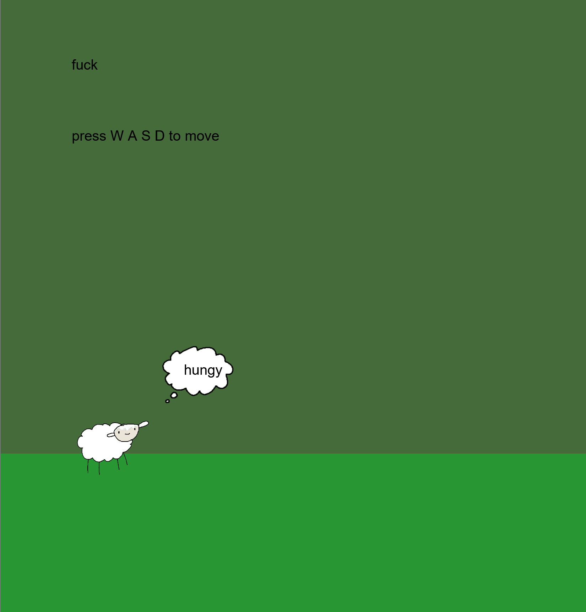

# Game that we will abandon in 7 days.



High level idea: we make a box and we hit people in the box

## Devloper

You need Node 26+. You can switch to Node 26 with `nvm use 26`.

```sh
npm install
npm run dev
```

Open this in your browser: http://localhost:6767/

Check types:

```sh
npx tsc
```

Final build:

```sh
npm run build
npm start
```

GitHub Pages preview:

```sh
GITHUB_PAGES=true npm run build
npm i -g http-server
http-server public -c-1 -s
```

# High Level Overview

```javascript
/groot
|- index.js
|- assets
|- src
    |- render.ts
    |- objects.ts
    |- rooms
        |- room.ts
        |- arena.ts
    |- player.ts
```

# Higher Level Overview

```
/root
|- game! :)
```
