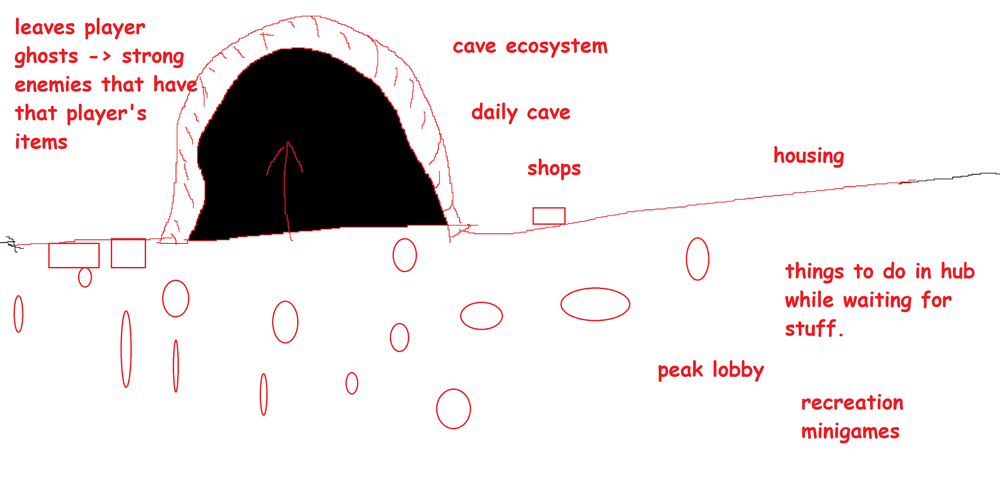
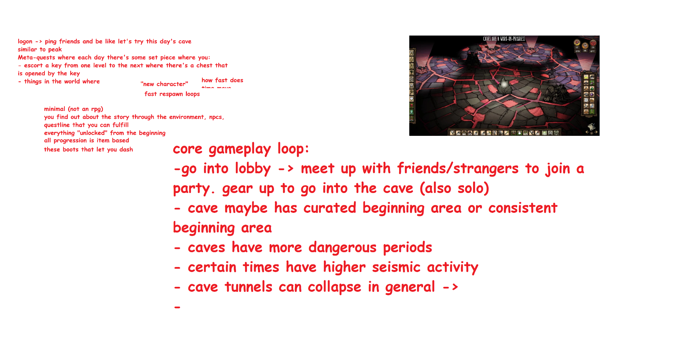

# proposal: Cave game but 2d

Central hub, where EVERYONE in the world exists and can be seen/interacted with. The Hub is big enough so that if there’s a lot of players it’s not like too scuffed. There’s one BIG gate/entrance to some cave that people gather around and it’s like a meeting/hub spot where people prepare before going into some large cave. 

"Cave" in concept - a mystical cave where there can be sunlight, etc. 

- Something really satisfying is looking back and seeing how far you've come - the progression should start fairly basic; with the caves being organic

  - Maybe you meet dwarves early on, and they help expand the size of the base area by mining out the walls more over time

  - The caves will start to expand and grow more complex over time

- leaves player ghosts -> strong enemies that have player's items

- cave ecosystem

- daily cave

- shops

- housing

- things to do in hub while waiting for stuff.

- peak lobby

- recreation minigames

logon -> ping friends and be like let's try this day's cave similar to peak

meta-quests where each day there's some set piece where you:

- escort a key from one level to the next where there's a chest that is opened by the key

- things in the world where 

"new character"

how fast does time move

fast respawn loops

- minimal (not an rpg)

- you find out about the story through the environment, npcs

- questline that you can fulfill

- everything "unlocked" from the beginning

- all progression is item based

- these boots that let you dash

core gameplay loop:

- go into lobby -> meet up with friends/strangers to join a party. gear up to go into the cave (also solo)

- cave maybe has curated beginning area or consistent beginning area

- caves have more dangerous periods

- certain times have higher seismic activity

- cave tunnels can collapse in general ->

-  
